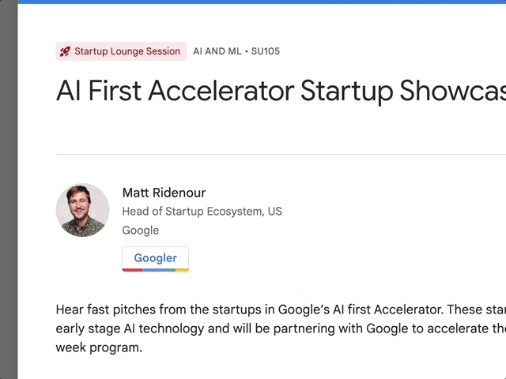

# google-next-2024-transcripts

# Abstract Reader



| Total Abstracts | Last Generated |
|-----------------|----------------|
| 702             | 2024-03-08     |

- A Selenium script to read the all presentation abstracts of the Google Next 2024 conference and extract the
  information of interest.
- All abstracts are stored in the [abstracts](abstracts) folder.
- Each file contains 100 abstracts and only pertinent information to work around Claude AI's token limitation when using
  the free subscription.

## Instructions

- Go to https://claude.ai
- Sign in with your Google account.
- Upload one of the abstracts files from the [abstracts](abstracts) folder.
- Prompt example:

```
Each line in this file represents a presentation at Google Next conference in JSON format.
I'm interested to learn about increasing developer productivity using Generative AI.
Include only "breakout" presentations.
Exclude presentations related to mobile development.
List the theme, presentation title, and the reason why I should attend them.
Present the output in a table.   
```

- Once you have the ideal prompt, upload other files and rerun it.